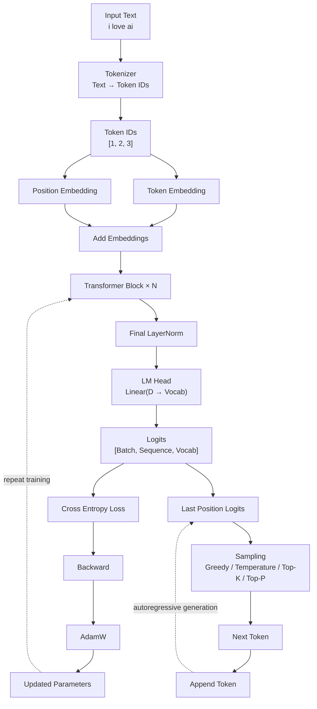

# TinyGPT — GPT From Scratch with PyTorch

A minimal GPT-style language model built from scratch using **PyTorch**, with the goal of understanding how modern decoder-only Transformers work internally.

This project progresses from Transformer fundamentals to a working TinyGPT capable of:

* Tokenization
* Token embeddings
* Positional embeddings
* Causal self-attention
* Multi-head attention
* Transformer blocks
* Layer normalization
* Feed-forward networks
* Language-model head
* Next-token prediction
* Cross-entropy loss
* PyTorch autograd
* AdamW optimization
* Model training
* Autoregressive text generation
* Temperature sampling
* Top-K sampling
* Top-P sampling

---

## Architecture



---

## High-Level Flow

```text
                         INPUT TEXT
                             │
                             ▼
                         Tokenizer
                             │
                             ▼
                         Token IDs
                             │
              ┌──────────────┴──────────────┐
              ▼                             ▼
       Token Embedding              Position Embedding
              │                             │
              └──────────────┬──────────────┘
                             ▼
                           ADD
                             │
                             ▼
                   Transformer Block
                             │
                             ▼
                         × N Blocks
                             │
                             ▼
                       LayerNorm
                             │
                             ▼
                         LM Head
                             │
                             ▼
                          LOGITS
                         [B,S,V]
                             │
                 ┌───────────┴───────────┐
                 ▼                       ▼
              TRAINING               INFERENCE
                 │                       │
                 ▼                       ▼
          Cross Entropy           Last Position
                 │                   Logits
                 ▼                       │
              Loss                      ▼
                 │                   Sampling
                 ▼                       │
             Backward                    ▼
                 │                  Next Token
                 ▼                       │
              AdamW                     Append
                 │                       │
                 ▼                       └──→ Repeat
          Updated Weights
```

---

# Transformer Block

Each Transformer block follows the **Pre-LayerNorm** architecture:

```text
                    Input x
                       │
              ┌────────┴────────┐
              │                 │
              ▼                 │
          LayerNorm              │
              │                 │
              ▼                 │
       Multi-Head Attention      │
              │                 │
              └───────┬─────────┘
                      ▼
                     ADD
                      │
                      ▼
                     x'
                      │
              ┌───────┴─────────┐
              │                 │
              ▼                 │
          LayerNorm              │
              │                 │
              ▼                 │
       Feed Forward Network      │
              │                 │
              └───────┬─────────┘
                      ▼
                     ADD
                      │
                      ▼
                    Output
```

---

# Self-Attention

For every input embedding we create:

```text
Q = Query
K = Key
V = Value
```

The attention calculation is:

```text
                    Q × Kᵀ
                       │
                       ▼
                 Scale by √dₖ
                       │
                       ▼
                  Causal Mask
                       │
                       ▼
                    Softmax
                       │
                       ▼
              Attention Weights
                       │
                       ▼
                    × V
                       │
                       ▼
                  Context
```

Mathematically:

```text
Attention(Q,K,V)
    = softmax(QKᵀ / √dₖ) V
```

---

# Causal Masking

GPT must not see future tokens while predicting the current token.

For:

```text
I love AI
```

the attention pattern is:

```text
          I    love    AI

I         ✓     ✗      ✗
love      ✓     ✓      ✗
AI        ✓     ✓      ✓
```

This allows the model to learn:

```text
I       → love
I love  → AI
```

without seeing the answer beforehand.

---

# Tensor Shapes

One of the most important concepts in the project is understanding tensor dimensions.

For example:

```text
Batch = 2
Sequence Length = 5
Embedding Dimension = 8
Vocabulary Size = 10000
```

The flow becomes:

```text
Token IDs
[2, 5]
   │
   ▼
Embedding
[2, 5, 8]
   │
   ▼
Transformer
[2, 5, 8]
   │
   ▼
LM Head
[2, 5, 10000]
```

The final dimension changes from:

```text
Embedding Dimension → Vocabulary Size
```

because the model must produce a score for **every possible vocabulary token**.

---

# Next-Token Prediction

GPT is trained using shifted input and target sequences.

Given:

```text
Tokens:

I love AI
```

we create:

```text
Input:  I    love
Target: love AI
```

Or with token IDs:

```text
Input:   [1, 2]
Target:  [2, 3]
```

The model therefore learns:

```text
1       → 2
[1, 2]  → 3
```

This simple idea is the foundation of GPT training.

---

# Training Pipeline

```text
Raw Text
   │
   ▼
Tokenizer
   │
   ▼
Token IDs
   │
   ▼
Sliding Windows
   │
   ▼
Input / Target Pairs
   │
   ▼
DataLoader
   │
   ▼
TinyGPT
   │
   ▼
Logits
   │
   ▼
Cross Entropy Loss
   │
   ▼
loss.backward()
   │
   ▼
Gradients
   │
   ▼
AdamW
   │
   ▼
Updated Parameters
   │
   └──────────────→ Repeat
```

---

# Autoregressive Generation

During inference, GPT generates one token at a time.

```text
Prompt
  │
  ▼
"I"
  │
  ▼
GPT
  │
  ▼
Predict "love"
  │
  ▼
"I love"
  │
  ▼
GPT
  │
  ▼
Predict "AI"
  │
  ▼
"I love AI"
  │
  ▼
GPT
  │
  ▼
Predict next token
  │
  ▼
Repeat
```

In code, the critical operation is:

```python
logits = model(token_ids)

next_token_logits = logits[:, -1, :]

next_token = torch.argmax(
    next_token_logits,
    dim=-1,
    keepdim=True
)

token_ids = torch.cat(
    [token_ids, next_token],
    dim=1
)
```

We only use:

```python
logits[:, -1, :]
```

because we need the prediction corresponding to the **last token in the current sequence**.

---

# Sampling Strategies

The model produces logits, which can be converted into probabilities.

```text
Logits
   │
   ▼
Temperature
   │
   ▼
Softmax
   │
   ▼
Probabilities
   │
   ├── Greedy
   │
   ├── Temperature Sampling
   │
   ├── Top-K
   │
   └── Top-P
```

### Greedy

Always select the highest-probability token.

```python
torch.argmax(logits)
```

### Temperature

Controls randomness.

```text
Low temperature
→ more deterministic

High temperature
→ more random
```

### Top-K

Keep only the K most probable tokens before sampling.

### Top-P

Keep the smallest set of tokens whose cumulative probability reaches P.

---

# Project Structure

```text
pytorch-gpt/
│
├── fundamentals/
│   ├── autograd.py
│   ├── linear.py
│   └── ...
│
├── transformer/
│   ├── multi_head_attention.py
│   ├── feed_forward.py
│   └── transformer_block.py
│
├── tiny_gpt/
│   └── model.py
│
├── training/
│   ├── dataset.py
│   └── train.py
│
└── README.md
```

---

# Current Implementation

The current TinyGPT contains:

```text
✓ Token Embeddings
✓ Positional Embeddings
✓ Multi-Head Attention
✓ Causal Masking
✓ Residual Connections
✓ Layer Normalization
✓ Feed Forward Network
✓ Transformer Blocks
✓ LM Head
✓ Next Token Prediction
✓ Cross Entropy Loss
✓ PyTorch Autograd
✓ AdamW Optimizer
✓ Training Loop
✓ Autoregressive Generation
✓ Greedy Decoding
✓ Temperature Sampling
✓ Top-K Sampling
✓ Top-P Sampling
✓ GPT Dataset / Sliding Window Pipeline
```

---

# Learning Objective

The goal of this project is **not** to build a production-scale GPT.

The goal is to understand what happens inside an LLM:

```text
Text
 ↓
Tokens
 ↓
Embeddings
 ↓
Attention
 ↓
Contextual Representations
 ↓
Transformer Blocks
 ↓
Logits
 ↓
Next Token
```

and how the model learns:

```text
Prediction
    ↓
Loss
    ↓
Gradient
    ↓
Parameter Update
    ↓
Better Prediction
```